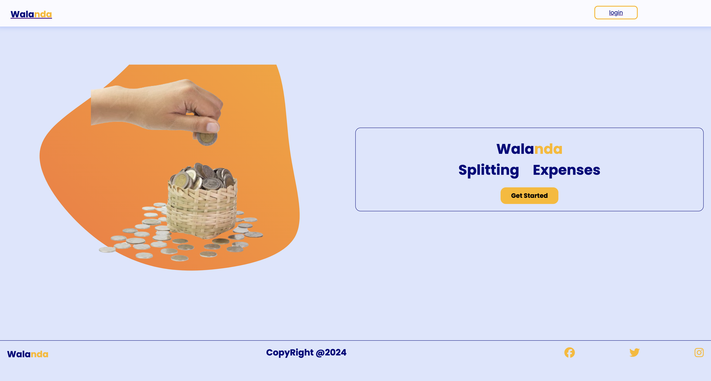

# Walanda

## About

## Technologies Used
+ ReactJs
+ Css
+ Figma

## Setup
To run this project, one must have either of the following;

1. Fork and clone this repository and have Visual Studio Code (Windows) or Code (Linux) and run the following commands in the local project directory :<br>

Clone the repository
```
git clone git@github.com:Noela-Murugi/walanda_frontend.git
```
Install dependancies
```
Run "npm install"
```
Install Compatible Version of react-router-dom
```
npm install react-router-dom@6.4.3
```
Run React App
```
npm start
```

## Sample Screenshots



## Live Page

[Frontend Link]()

## Copyright and License
[MIT](https://)

Copyright (c) 2024 Walanda

Permission is hereby granted, free of charge, to any person obtaining a copy of this software and associated documentation files (the "Software"), to deal in the Software without restriction, including without limitation the rights to use, copy, modify, merge, publish, distribute, sublicense, and/or sell copies of the Software, and to permit persons to whom the Software is furnished to do so, subject to the following conditions:

The above copyright notice and this permission notice shall be included in all copies or substantial portions of the Software.

THE SOFTWARE IS PROVIDED "AS IS", WITHOUT WARRANTY OF ANY KIND, EXPRESS OR IMPLIED, INCLUDING BUT NOT LIMITED TO THE WARRANTIES OF MERCHANTABILITY, FITNESS FOR A PARTICULAR PURPOSE AND NONINFRINGEMENT. IN NO EVENT SHALL THE AUTHORS OR COPYRIGHT HOLDERS BE LIABLE FOR ANY CLAIM, DAMAGES OR OTHER LIABILITY, WHETHER IN AN ACTION OF CONTRACT, TORT OR OTHERWISE, ARISING FROM, OUT OF OR IN CONNECTION WITH THE SOFTWARE OR THE USE OR OTHER DEALINGS IN THE SOFTWARE.
